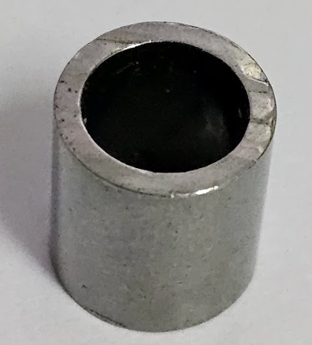

# Experimental Design

This study focuses on the **material part inspection** process, as illustrated in **Figure 1**.

* **Target Object:** Small cylindrical components (height: **1.25 cm**, diameter: **1.0 cm**).
* **Inspection Challenge:** Detecting burr defects on miniature components is challenging due to the small size of the target objects.
* **Imaging Challenges:** Image acquisition is affected by inconsistent illumination, low contrast, and surface reflections caused by the material's reflective properties, making defect identification more difficult.

## Equipment
- Imaging device: Samsung Galaxy S23 Ultra (SM-S918B/DS)

## Camera parameter
- Aperture (f-number): f/
- ISO
- Shutter speed: __ ms
- White balance: __ (auto / fixed Kelvin)
- Focus mode: manual (center)

## Geometry
- Distance camera-to-object __ (cm)
- Angle __ (top-down / oblique)
